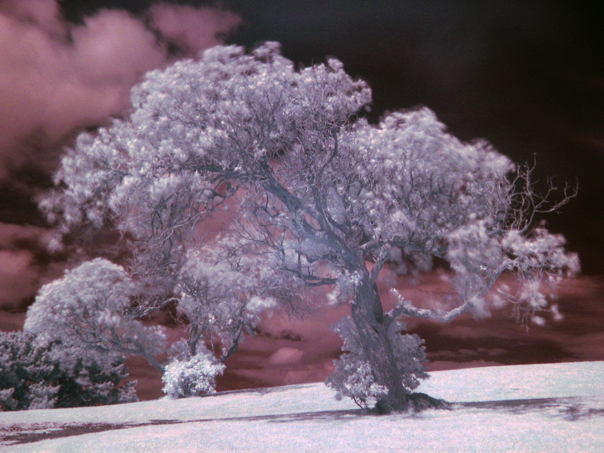
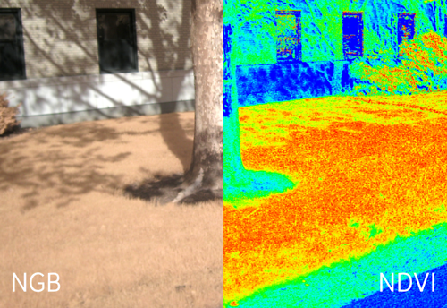
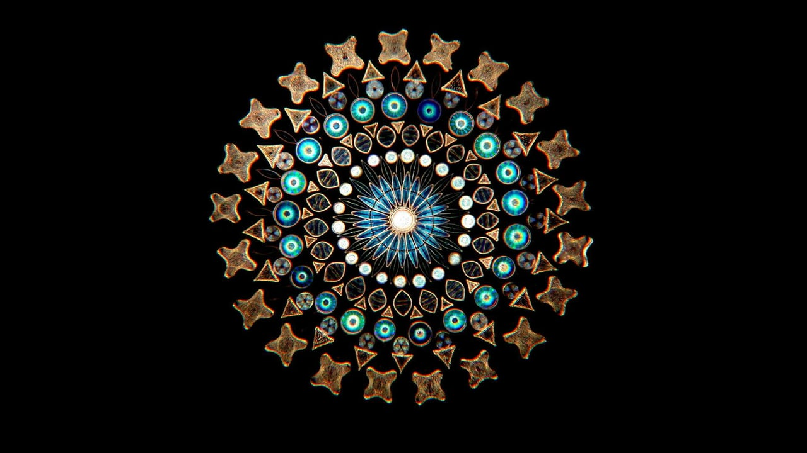
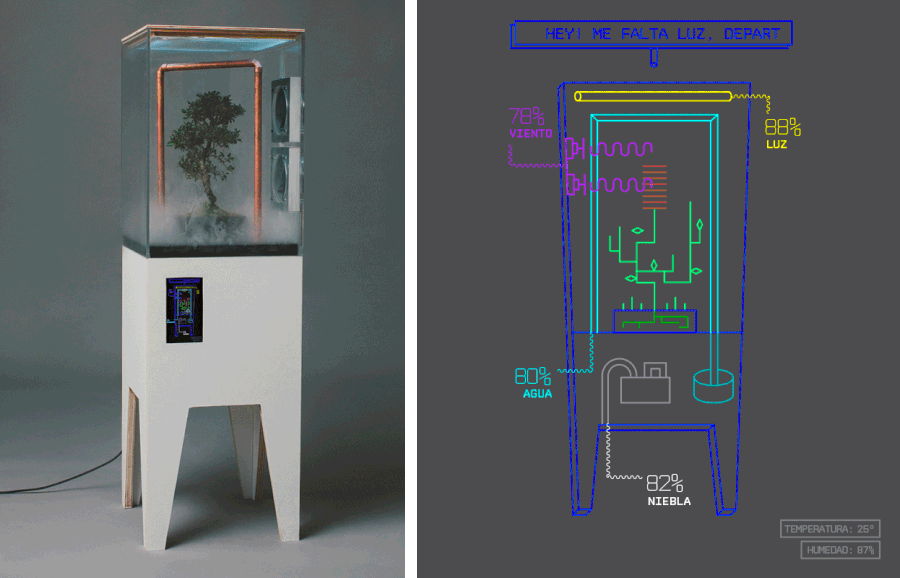

## Infrared Photography

### Infrared Photography w/ Analog Film Camera
An analog camera equipped with film for near-infrared light.  

#### Required Materials
- film camera w/ focusing rings for the infrared spectrum (owned)
- infrared film
- infrared film development - either done locally or shipped out

### Infrared Analysis of Plant Health
Capturing digital photos of vegetation and analyzing them for information on plant health with a Raspberry Pi.

  

More information at <https://infragram.org/>.

#### Involves
- writing software for the Raspberry Pi using existing libraries and interfacing with Public Labs/the Infragram project
- adapting the drone gimbals for the Pi's camera
- creating a system for filters/correct white balance of the photos
- photogrammetry of Parcel B/other areas

#### Required Materials
- Raspberry Pi w/ infrared camera (owned)
- drones
- new filters
- updated camera
- different raspberry pi models
  - pi zero for portability
  - compute module for dual cameras

## Diatom/SEM Arrangements
Decorative arrangements of miniature objects on a massive scale.  
<https://vimeo.com/90160649>  

Klaus Kemp's website: <http://www.diatoms.co.uk/>

#### Involves
- writing software for stitching SEM photos
- collecting and arranging items
- researching adhesives (for non-SEM microscopes)

## Perception Installation w/ Strobe Light
A strobe light room containing a variety of exhibits that cause the viewer to acknowledge and question their perceptual limitations.  
This is inspired by Bill Seeley's lecture and my experience playing with a fellow student's strobe light.  
It's a little hard to describe but the experience is incredibly compelling.

#### Involves
- research into the anatomy/psychology of the effects
- building/picking a room
- creating exhibits
- tackling the problem of potential epilepsy/seizures

A video of animated sculptures: <https://vimeo.com/116582567>

An article about the challenges of another strobe exhibit: <https://www.theatlantic.com/entertainment/archive/2013/09/strobe-light-filled-art-exhibit-closes-after-causing-three-seizures/310470/>

## Aesthetic Terarium/Aeroponics/Aquaponics/Hydroponics installation
A self-contained life-support system for plants.  
Offers a connection to NASA/future of agriculture

<http://www.espadaysantacruz.com/projects/dotsai>  
